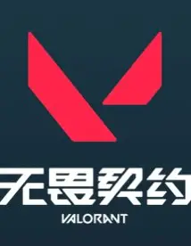
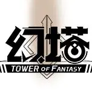
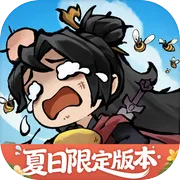
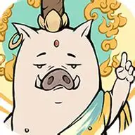
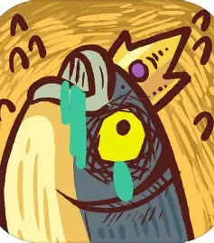

[index.html](https://github.com/user-attachments/files/32188862/index.html)
<!DOCTYPE html>
<html lang="zh-CN">
<head>
<meta charset="UTF-8">
<meta name="viewport" content="width=device-width, initial-scale=1.0">
<title>陈佳佳 · 游戏社区运营个人主页</title>
<link rel="preconnect" href="https://fonts.googleapis.com">
<link rel="preconnect" href="https://fonts.gstatic.com" crossorigin>
<link href="https://fonts.googleapis.com/css2?family=Playfair+Display:wght@400;700;900&family=Noto+Serif+SC:wght@300;400;500;700;900&family=Noto+Sans+SC:wght@300;400;500;700&family=JetBrains+Mono:wght@400;500&display=swap" rel="stylesheet">

</head>
<body>
  <header class="topbar">
    

      
Chen Jiajia

      <nav>
        <ul class="nav">
          <li><a href="#about">ABOUT</a></li>
          <li><a href="#games">GAMES</a></li>
          <li><a href="#internship">INTERNSHIP</a></li>
          <li><a href="#experience">EXPERIENCE</a></li>
          <li><a href="#works">WORKS</a></li>
          <li><a href="#skills">SKILLS</a></li>
          <li><a href="#contact">CONTACT</a></li>
        </ul>
      </nav>
    

  </header>

  <section class="hero" id="about">
    

      
PERSONAL PORTFOLIO · 2026

      <h1>陈<em>佳佳</em></h1>
      
A player. A community operator.

      

        深圳大学工商管理本科在读，曾于深圳冰川网络《我要当老祖》项目组担任社区运营实习生，
        完整经历产品<strong>内测末期 — 公测上线 — 暑期大版本</strong>的运营周期。
        具备多平台内容运营、活动策划落地、玩家社区氛围建设与跨团队协同能力；
        以玩家身份长期深度体验放置类与 MMORPG 产品，习惯用<strong>“用户问题-运营动作-结果反馈”</strong>进行拆解和记录。
      

      

        📞 19200420107
        📧 13826118669@163.com
        💬 a1048955336
        📍 深圳
      

    

  </section>

  <section class="section" id="games">
    

      

        
Chapter 01

        
游戏档案

        
GAME PROFILE

      

      

        <article class="game-card">
          
          

            <h3>杖剑传说</h3>
            
MMORPG · 放置成长 · 7个月深度体验

            
内测+公测持续跟进，关注职业平衡、赛季节奏、用户情绪与社区讨论变化。

          

        </article>
        <article class="game-card">
          
          

            <h3>无畏契约</h3>
            
FPS · 竞技体系 · 2年

            
长期体验排位生态，关注版本平衡对局内行为与玩家反馈节奏的影响。

          

        </article>
        <article class="game-card">
          
          

            <h3>英雄联盟</h3>
            
MOBA · 长线运营 · 3年

            
关注活动节点、通行证设计、英雄强度调整对留存与活跃的拉动方式。

          

        </article>
        <article class="game-card">
          
          

            <h3>幻塔</h3>
            
开放世界 · MMO社交 · 2年

            
关注大版本更新、跨系统内容投放和长线付费体验的一致性。

          

        </article>
      

    

  </section>

  <section class="section" id="internship">
    

      

        
Chapter 02

        
实习经历

        
INTERNSHIP

      

      
在<strong>放置类修仙手游《我要当老祖》</strong>项目组，完整经历<strong>内测末期 → 公测上线 → 暑期大版本</strong>的运营周期：从多平台内容供给、活动策划落地，到以官方人格与玩家日常对话、跨部门对齐版本释放节奏，形成一套<strong>可复用的社区运营打法</strong>。

      

        <article class="exp-card exp-card--featured">
          

            
Internship

            
2026.05 — 2026.08

            <ul class="exp-skills" aria-label="相关能力">
              <li>多平台内容</li>
              <li>活动运营</li>
              <li>玩家沟通</li>
              <li>跨部门协同</li>
              <li>AI 提效</li>
            </ul>
          

          

            <h4 class="exp-title-with-icon">
              
              深圳冰川网络《我要当老祖》项目组
            </h4>
            
COMMUNITY OPS INTERN · 社区运营实习生 · 放置类修仙手游

            

              
<b>24.8万</b>公众号累计阅读人数 单篇峰值 1.6 万+

              
<b>1.4万</b>爆款活动帖浏览 留言 2000+

              
<b>49万+</b>TapTap 社区关注 累计发帖 6000+

              
<b>前 0.28%</b>微信游戏圈访问用户数 全平台排名 271/95242

            

            

              

                
多平台内容运营

                
统筹 TapTap、微信游戏圈、微信公众号、抖音、好游快爆等平台的内容策划与发布，保持<strong>日更 1-2 篇</strong>的稳定供给；主导限定角色长图 SOP、公测内容一览图、暑期活动长图节奏释放等系列内容，形成各平台差异化的内容表达。

              

              

                
活动策划与用户互动

                
主导节日、抽奖等主题活动帖的策划与落地，单帖稳定实现<strong>浏览 5000+、留言 400+</strong>；通过话题设计与互动机制优化持续放大参与度，其中爆款活动帖达成<strong>浏览 1.4 万、留言 2000+</strong> 的社区互动峰值。

              

              

                
官方人格化运营

                
以「<strong>南猫猫</strong>」官方运营身份活跃于各社区平台与玩家社群，主导日常互动与氛围维护；在一线对话中捕捉玩家真实诉求并快速响应传达，让官方形象保有<strong>“真人味”</strong>的同时保持响应效率。

              

              

                
跨部门协同与节奏统筹

                
对接 <strong>GS、客服、美术、研发</strong>等多部门核对新版本释放内容，统筹策划内容的释放节奏与社区侧落地排期，保障版本信息<strong>准确、按节奏、及时</strong>触达玩家。

              

              

                
社区生态与板块搭建

                
参与 TapTap、微信游戏圈、好游快爆、抖音小游戏及游戏自建社区「<strong>论道阁</strong>」的板块搭建与内容体系建设，熟练使用各平台运营功能；期间微信游戏圈粉丝达 <strong>3.7 万+</strong>，<strong>日新增 664 / 退圈仅 15</strong>，沉淀高粘性的玩家社区氛围。

              

              

                
AI 工具提效

                
运用 AI 工具辅助 TapTap 买量素材设计与社区内容生产，参与投放创意迭代，投放实现<strong>点击率 4.74%、详情页转化率 7.54%</strong>；并将 AI 能力嵌入选题策划与长图生产流程，沉淀可复用的内容生产 SOP。

              

            

            
<strong>周期覆盖：</strong>内测末期切入 → 公测上线爆发期 → 暑期大版本活动期，完整参与一款长线放置类产品从冷启动到版本运营的社区侧全流程。

          

        </article>
      

    

  </section>

  <section class="section" id="experience">
    

      

        
Chapter 03

        
项目经历

        
EXPERIENCE

      

      
以下经历按<strong>产品运营</strong>常用能力组织表述：从用户/场景需求拆解目标，用<strong>里程碑与数据</strong>推进迭代，在<strong>跨职能协作</strong>中保障交付，并把可复用流程沉淀为资产——与版本节奏、活动运营、用户触达等岗位场景同构。

      

        <article class="exp-card">
          

            
2024.05 — 2024.06

            <ul class="exp-skills" aria-label="相关能力">
              <li>0-1 交付</li>
              <li>需求拆解</li>
              <li>用户触达</li>
            </ul>
          

          

            <h4>开普勒星人分享会（沙龙）</h4>
            
PROJECT OWNER · 策划负责人 · 活动全链路

            

              

                
需求定义与范围管理

                
识别校内对<strong>互联网行业实习与就业</strong>的路径、岗位与准备节奏等信息需求，以及报名与咨询仍分散在多个触点的现状，将「认知—报名—到场—反馈」收敛为一条可交付链路。在约 <strong>2 个月</strong>内牵头 <strong>6 人</strong>跨小组，对齐方案、嘉宾与物料、宣发节奏、现场流程与复盘文档的<strong>范围与优先级</strong>。

              

              

                
执行推进与风险处置

                
按里程碑拆解任务并同步干系人；将咨询侧沉淀为<strong>50+ 人</strong>社群运营，对高频问题做分类与话术迭代，相当于轻量用户运营与 FAQ 维护。现场突发时快速调整环节顺序，控制风险对<strong>核心体验路径</strong>的影响。

              

              

                
复盘与流程资产

                
交付书面复盘与问题清单，将可重复环节固化为后续同类活动的<strong>流程说明与 FAQ 素材</strong>——对应产品中「文档化 + 降低下次交付成本」的做事方式。

              

            

          

        </article>
        <article class="exp-card">
          

            
2024.03 — 2024.07

            <ul class="exp-skills" aria-label="相关能力">
              <li>指标意识</li>
              <li>内容迭代</li>
              <li>增长触达</li>
            </ul>
          

          

            <h4>深圳大学学生会公众号</h4>
            
CONTENT OPS · 内容运营 · 增长向触达

            

              

                
用户场景与北极星指标

                
校招季信息过载，目标用户更需要<strong>可追更、结构清晰</strong>的就业指导内容。在 <strong>5 个月</strong>内对就业向栏目负责，将<strong>阅读与互动</strong>作为核心观测指标，用推送节奏与选题规划承接「拉新—留存—转化注意力」的运营逻辑。

              

              

                
假设验证与快速迭代

                
从 0 搭建「就业宝典」「job馆」等栏目，把每一次推送当作一次<strong>小版本</strong>：结合阅读与「在看」等数据做标题与信息结构的 A/B 式优化；用秀米统一版式，固化「策划—撰写—发布—数据复盘—改版」闭环，贴近版本迭代中的<strong>数据反馈—调优</strong>习惯。

              

              

                
结果与可复用方法论

                
系列推文累计阅读 <strong>5000+</strong>；沉淀复盘模板与版式规范，便于<strong>新成员按同一标准续写栏目</strong>，与运营侧「SOP + 轻量知识库」的沉淀思路一致。

              

            

          

        </article>
        <article class="exp-card">
          

            
2023.09 — 2024.12

            <ul class="exp-skills" aria-label="相关能力">
              <li>多项目</li>
              <li>资源协调</li>
              <li>里程碑</li>
            </ul>
          

          

            <h4>深圳大学（丽湖）学生会实践部</h4>
            
TEAM LEAD · 部门负责人 · 资源与节奏

            

              

                
复杂场景下的优先级

                
就业季并行分享会、就业电台、春秋招、沙龙等多条「产品线」，宣传、场置与现场执行<strong>资源竞争</strong>明显。在 <strong>约 16 个月</strong>内以负责人身份做分工与排期，让单场活动从预告到撤场的<strong>关键路径可追踪</strong>，类似多版本并行时的节奏管理。

              

              

                
跨职能落地与关键场次

                
将物料、人力与时间节点<strong>清单化</strong>，对齐设计、宣传与现场多方交付物，推进宣发与现场执行无缝衔接，保障重点场次<strong>峰值体验</strong>可控。

              

              

                
交付质量与协作机制

                
在多项目重叠下保持<strong>节点按期交付</strong>；通过固定对齐节奏降低跨组信息差与重复劳动，使协作方式可复用到下一届活动——对应产运中「稳定交付 + 降低沟通税」。

              

            

          

        </article>
      

    

  </section>

  <section class="section" id="works">
    

      

        
Chapter 04

        
作品集

        
WORKS

      

      

        <article class="work">
          
01

          <h4>《杖剑传说》玩家反馈分析</h4>
          
围绕玩家讨论高频问题，提炼情绪焦点与可执行优化建议，展示“反馈-判断-动作”能力。

          <a href="./work-01-player-feedback.html">OPEN PAGE</a>
        </article>
        <article class="work">
          
02

          <h4>放置类竞品横评</h4>
          

            
            
            
          

          

            竞品分析
            商业化
            留存路径
          

          
对比三款头部产品的题材、玩法、商业化与留存路径，提炼可迁移的运营启示。

          <a href="./work-02-idle-competitors.html">OPEN PAGE</a>
        </article>
        <article class="work">
          
03

          <h4>《我的勇者》七周年 TapTap 社区运营节奏分析</h4>
          

            
          

          

            节奏拆解
            UGC 引导
            危机响应
          

          
完整跟踪官方号 16 天、五阶段共 17 条发帖节奏，拆解互动设计、话题标签、礼包码与 UGC 引导策略，总结六条可复用的社区运营手法。

          <a href="./work-03-community-rhythm.html">OPEN PAGE</a>
        </article>
        <article class="work">
          
04

          <h4>《我要当老祖》 社区运营内容作品集</h4>
          

            
          

          

            买量图
            长图
            社区内容图
            表情包
          

          
实习期间产出的社区视觉内容合集，涵盖 TapTap 买量素材、版本长图、社区内容配图与官方表情包设计。

          <a href="./work-04-visual-works.html">OPEN PAGE</a>
        </article>
      

    

  </section>

  <section class="section" id="skills">
    

      

        
Chapter 05

        
能力与工具

        
CAPABILITIES & TOOLS

      

      

        <article class="skill-card">
          <h3>游戏洞察与产品思维</h3>
          <ul>
            <li>主玩放置类与 MMORPG，习惯主动拆解游戏设计意图与运营逻辑</li>
            <li>深度参与放置类修仙产品从内测末期到公测、暑期大版本的完整运营周期</li>
            <li>独立产出玩家反馈分析与放置类竞品横评报告</li>
            <li>能将玩家体验转化为可执行的产品与运营洞察</li>
          </ul>
        </article>
        <article class="skill-card">
          <h3>内容策划与数据运营</h3>
          <ul>
            <li>限定角色长图 SOP、版本内容一览图、活动长图节奏释放等系列内容策划</li>
            <li>覆盖 TapTap、微信游戏圈、公众号、抖音、好游快爆等多平台分发</li>
            <li>持续追踪传播数据并迭代选题方向</li>
            <li>形成“策划—发布—数据复盘—调优”的完整运营闭环</li>
          </ul>
        </article>
        <article class="skill-card">
          <h3>跨团队协作与用户运营</h3>
          <ul>
            <li>与 GS、客服、美术、研发等多部门协同沟通</li>
            <li>核对新版本释放内容并统筹内容释放节奏</li>
            <li>以官方运营人格活跃于社区，捕捉并传达真实玩家需求</li>
            <li>在保持官方响应效率的同时保有“真人味”的运营形象</li>
          </ul>
        </article>
        <article class="skill-card">
          <h3>活动执行与落地能力</h3>
          <ul>
            <li>节日、抽奖等主题社区活动全流程策划与落地</li>
            <li>通过话题设计与互动机制激发玩家参与</li>
            <li>带领团队完成线下沙龙方案制定与执行</li>
            <li>搭建用户运营群并基于反馈持续优化活动体验</li>
          </ul>
        </article>
        <article class="skill-card">
          <h3>AI 工具应用与自驱学习</h3>
          <ul>
            <li>Claude · Seedance · GPT Image 等 AI 工具应用</li>
            <li>辅助买量素材设计、社区内容生产与竞品分析</li>
            <li>能将 AI 能力落地为可交付产出与可复用 SOP</li>
            <li>学习能力强、适应性高，能在高压环境下保持效率</li>
          </ul>
        </article>
        <article class="skill-card">
          <h3>设计与办公工具</h3>
          <ul>
            <li>Photoshop · 剪映</li>
            <li>飞书 · Word · Excel · PPT</li>
            <li>TapTap / 微信游戏圈 / 公众号等各平台创作者后台</li>
            <li>活动主视觉、长图版式与数据材料产出</li>
          </ul>
        </article>
      

    

  </section>

  <section class="section" id="contact" style="border-bottom:none;">
    

      

        
Chapter 06

        
联系方式

        
OPEN TO OPPORTUNITIES

      

      

        

          
PHONE

          
19200420107

        

        

          
EMAIL

          
13826118669@163.com

        

        

          
WECHAT

          
a1048955336

        

      

      

        <a class="resume-btn" href="./resume.pdf" target="_blank" rel="noopener">
          &#8595;
          
            <b>下载完整简历</b>
            <em>PDF · 陈佳佳 · 游戏社区运营</em>
          
        </a>
      

    

  </section>

  <footer class="foot">CHEN JIAJIA · GAME COMMUNITY OPERATIONS PORTFOLIO · 2026</footer>
</body>
</html>
